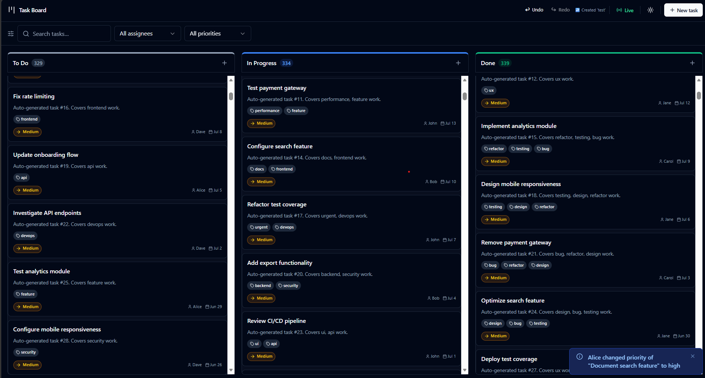
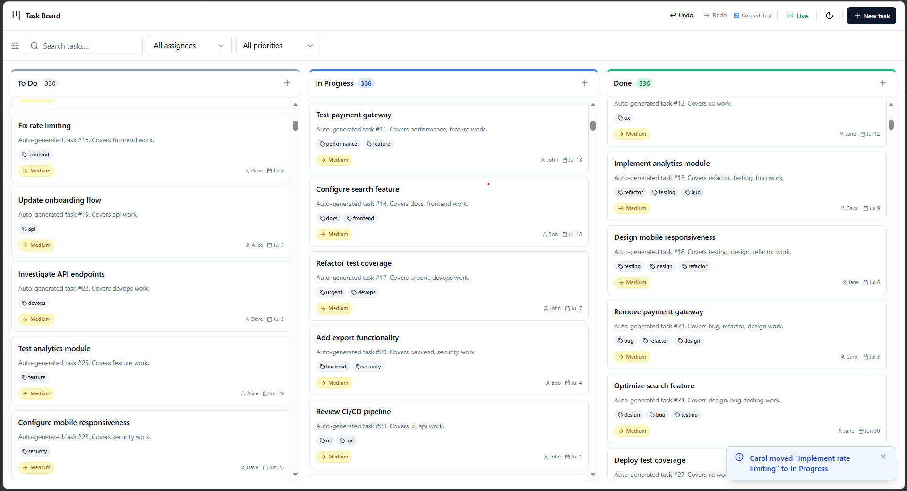

# Real-Time Collaborative Task Board

A kanban-style task management board built as a full-stack frontend assessment. Covers all three parts of the spec: core kanban UI (Part 1), optimistic updates + real-time simulation + virtualization (Part 2), and an undo/redo system (Part 3 — Option A).

---

## Preview

| Dark Mode | Light Mode |
|---|---|
|  |  |

---

## Quick Start

```bash
npm install
npm run dev       # http://localhost:5173
npm test          # 50 tests, all passing
npx tsc --noEmit  # 0 type errors
```

---

## Features

### Part 1 — Core Functionality

- 3-column kanban board: **Todo**, **In Progress**, **Done**
- Task cards display: title, description, priority (color-coded badge), assignee, created date, tags
- Drag-and-drop between columns and within columns via `@dnd-kit`
- **Create / Edit / Delete** modal with full validation — required fields, character limits, inline error messages
- **Filter** by assignee, priority, and tags (AND logic — a task must match all selected tags)
- **Search** by title or description with 300ms debounce

### Part 2 — Advanced Features

- **Optimistic updates** — every change applies to the UI instantly before the API responds; rolled back silently on failure
- **Mock API** — 2-second simulated delay, 10% random failure rate
- **Loading states** — spinner ring on cards with in-flight operations; Save/Delete buttons show loading state in modal
- **Race condition protection** — concurrent ops on the same card are blocked; each in-flight closure holds its own rollback snapshot, so concurrent ops on different cards are safe and independent
- **Real-time simulation** — background timer fires every 10–15s simulating an external user (Alice, Bob, Carol, or Dave) changing a random task field; shows an info toast on each change
- **Conflict detection** — if the changed task is currently open in the modal, shows a warning toast instead
- **Virtualized rendering** — TanStack Virtual renders ~15 DOM nodes per column regardless of total count; board ships with 1000 tasks to prove it

### Part 3 — Expert Challenge (Option A: Undo/Redo)

- **50-entry history stack** — oldest entry dropped when the cap is reached
- **Keyboard shortcuts** — `Ctrl/Cmd+Z` (undo), `Ctrl/Cmd+Shift+Z` (redo), `Ctrl+Y` (redo alias)
- Shortcuts suppressed when focus is inside `<input>`, `<textarea>`, or `contentEditable`
- **History Indicator** in the header shows the label of the action that will be undone/redone
- **History = committed reality** — actions are only recorded after the API confirms success; failed/rolled-back operations are never added to the stack and cannot be undone

---

## Accessibility

The board is fully operable without a mouse. All interactive elements are keyboard-accessible, and screen reader support is built in throughout.

### Keyboard Shortcuts

| Shortcut | Action |
|---|---|
| `Ctrl / Cmd + Z` | Undo last action |
| `Ctrl / Cmd + Shift + Z` | Redo |
| `Ctrl + Y` | Redo (Windows alias) |
| `Tab` | Move focus between cards and controls |
| `Space` | Lift a focused card to begin dragging / drop it |
| `Arrow keys` | Move a lifted card between columns or positions |
| `Enter` | Open the edit modal on a focused card |
| `Escape` | Cancel an active drag and return card to its original position |

> Undo/Redo shortcuts are suppressed when focus is inside a text input or textarea — they never conflict with native browser undo.

### Screen Reader Support

- **Drag-and-drop announcements** — every drag event is narrated: pickup instructions, column-over updates, drop confirmation, and cancel message
- **Undo/Redo labels** — the History Indicator uses `aria-live="polite"` + `aria-atomic="true"` so the action label is announced after every committed change, undo, or redo
- **Toast notifications** — each toast uses `role="alert"` for immediate announcement of API results, real-time changes, and conflict warnings
- **Column landmarks** — each column is a `role="region"` with a label; the task list inside is `role="list"` with `role="listitem"` on each card so screen readers announce position ("2 of 30")
- **Form validation** — required fields use `aria-required`, errors set `aria-invalid` and `aria-describedby` pointing to the inline error message
- **Undo/Redo buttons** — dynamic `aria-label` reflects the exact action: `"Undo: Moved 'Fix bug' to Done"` or `"Nothing to undo"`
- **Simulator toggle** — uses `aria-pressed` to reflect active/inactive state correctly

### Other

- Single tab stop per card — `SortableTaskCard` prevents the inner `<article>` from creating a duplicate focus trap
- Focus is trapped inside the modal while open and returned to the trigger element on close (WAI-ARIA Dialog pattern via Radix)
- Visible focus rings on all interactive elements (keyboard-only — not shown on mouse click)
- All decorative icons are `aria-hidden="true"` — they are never announced by screen readers

---

## Tech Stack

| Library | Version | Why chosen | Rejected alternative |
|---|---|---|---|
| React | 18 | Concurrent features, broad ecosystem, assessment target | — |
| Vite | 5 | Sub-second HMR, native ESM, Vitest integration | Create React App (unmaintained) |
| TypeScript | 5 (strict) | Catches state shape bugs at compile time; required for large store | Plain JS |
| Zustand | v5 | Minimal boilerplate, no Provider wrapping, built-in `useShallow` for fine-grained subscriptions, excellent DevTools | Redux Toolkit (more boilerplate), Context API (causes full tree re-renders on every state change) |
| Immer (via zustand/middleware) | 10 | Write mutable-looking state mutations safely; required for the Set-based `loadingIds` | Manual spread updates (error-prone with nested state) |
| Tailwind CSS | **v3.4.x (pinned)** | Utility-first, zero unused CSS in prod, aligns with shadcn/ui | **v4 is explicitly excluded** — it breaks shadcn/ui's CSS variable system entirely |
| shadcn/ui | latest | Accessible, unstyled-at-core Radix primitives with Tailwind wiring; Dialog, Select, Badge used directly | Headless UI (less comprehensive), MUI (too opinionated) |
| @dnd-kit | core@6 + sortable@8 | Accessible (keyboard drag), TypeScript-native, works correctly with React 18 and virtualized lists | react-beautiful-dnd (archived, broken in React 18 StrictMode) |
| TanStack Virtual | v3 | Dynamic height support via `measureElement` — cards have variable content so fixed-height approaches fail | react-window (fixed height only), react-virtuoso (heavier) |
| Framer Motion | v11 | Declarative `AnimatePresence` for toast/modal transitions | CSS-only (insufficient for enter/exit sequencing), GSAP (overkill) |
| Vitest | v4 | Vite-native test runner, same API as Jest, no config needed for TSX/aliases | Jest (requires separate Babel/ts-jest config for Vite projects) |
| React Testing Library | latest | Tests behaviour, not implementation; pairs naturally with Vitest | Enzyme (implementation-focused, deprecated) |

---

## Architecture

### Store (Zustand + Immer)

The global state is split into 5 independent slices, all combined into a single `useStore`:

```
useStore
├── taskSlice        tasks: Record<id, Task>  |  _snapshot for rollback
│                    optimisticMove / optimisticAdd / optimisticUpdate / optimisticDelete
│                    commitOptimistic / rollbackOptimistic / restoreSnapshot
│                    applyExternalChange  ← used by real-time simulator
│
├── historySlice     past: HistoryAction[]  (max 50)  |  future: HistoryAction[]
│                    pushHistory / undo / redo
│
├── filterSlice      search / assignee / priority / tags
│                    setFilter / resetFilters
│
├── uiSlice          toasts[]  |  openModalId  |  loadingIds: Set<string>
│                    draggingId  |  isDarkMode
│                    addToast / removeToast / openModal / closeModal / setLoading
│
└── realtimeSlice    isSimulatorActive  |  lastExternalChange
                     toggleSimulator / setLastExternalChange
```

### Directory Structure

```
src/
├── components/
│   ├── board/          # BoardView (DndContext), KanbanColumn (virtualized), BoardDragOverlay
│   ├── task/           # TaskCard (memoized), SortableTaskCard (dnd wrapper), TaskModal, Skeleton
│   ├── filters/        # FilterBar, SearchInput (debounced)
│   ├── history/        # HistoryIndicator
│   ├── layout/         # Header, ToastContainer, ErrorBoundary
│   └── ui/             # shadcn/ui generated components — do not hand-edit
├── store/
│   ├── index.ts        # Combined store with Immer middleware
│   ├── slices/         # One file per slice (taskSlice, historySlice, filterSlice, uiSlice, realtimeSlice)
│   └── selectors.ts    # Memoized derived selectors (column counts, assignee list, undo/redo state)
├── hooks/
│   ├── useDragAndDrop.ts       # All @dnd-kit logic, order calculation, optimistic move
│   ├── useOptimisticTask.ts    # create/update/delete with snapshot → commit/rollback
│   ├── useFilteredTasks.ts     # Returns filtered+sorted task IDs per column (memoized)
│   ├── useRealtimeSimulator.ts # setTimeout loop, random mutations, conflict detection
│   ├── useUndoRedo.ts          # Global keyboard listener with input guard
│   └── useVirtualColumn.ts     # TanStack Virtual config shared across columns
├── types/index.ts      # All TypeScript interfaces: Task, HistoryAction, FilterState, Toast, ExternalChange
├── lib/
│   ├── api.ts          # Mock API: 2s delay + 10% failure rate
│   ├── mockData.ts     # 15 seed tasks + generateMockTasks(n) for 1000-task demo
│   └── utils.ts        # cn() helper, date formatters
└── __tests__/          # Vitest test suites (see Testing section)
```

### Data Flow — Optimistic Update

```
User action (drag / create / edit / delete)
  │
  ├─ snapshot = structuredClone(get().tasks)   ← captured OUTSIDE Immer set()
  ├─ optimisticXxx()   → applies change to UI immediately
  ├─ setLoading(id, true)
  │
  ├─ api.xxx()  →  2s delay  →  10% chance of rejection
  │
  ├─ SUCCESS:  commitOptimistic()
  │            pushHistory({ type, label, snapshot })
  │            setLoading(id, false)
  │            addToast('success')
  │
  └─ FAILURE:  restoreSnapshot(snapshot)   ← per-closure, not the shared _snapshot slot
               addToast('error')
               setLoading(id, false)
               (nothing pushed to history)
```

---

## Key Design Decisions

### 1. `structuredClone` must be called outside Immer's `set()` callback

Immer wraps the state argument in a `Proxy` for change tracking. `structuredClone` cannot clone a Proxy and throws a `DataCloneError`. All snapshots are captured via `get().tasks` before entering `set()`:

```ts
// WRONG — crashes
set((state) => { state._snapshot = structuredClone(state.tasks) })

// CORRECT
const snapshot = structuredClone(get().tasks)
set((state) => { state._snapshot = snapshot })
```

### 2. Per-closure snapshots for concurrent operations

The store has a single `_snapshot` slot. If two operations ran concurrently, the second would overwrite the first's snapshot and a rollback would restore the wrong state. Each hook closure captures its own snapshot at call time and calls `restoreSnapshot(snapshot)` directly, bypassing the shared slot entirely.

### 3. `isBusyRef` guard in TaskModal

Optimistic mutations update the store instantly, which re-fires `useEffect([editingTask])` and would reset `isSubmitting` back to `false` while the API is still in-flight — making the loading spinner disappear immediately. A `useRef` flag suppresses the effect reset without causing extra renders (unlike `useState`):

```ts
const isBusyRef = useRef(false)
useEffect(() => {
  if (isBusyRef.current) return  // skip while API is in-flight
  // ... reset form state
}, [isOpen, isEdit, editingTask])
```

### 4. History only records committed reality

`pushHistory()` is called only inside the success branch, after `commitOptimistic()` confirms the API accepted the change. Rolled-back operations are never recorded. This means undo always restores to a state that actually existed — not a speculative one.

### 5. `enableMapSet()` in both `main.tsx` and `__tests__/setup.ts`

`loadingIds` is a `Set<string>`. Immer requires its MapSet plugin to handle `Set` and `Map` mutations. It must be called in every Immer entry point — both the app bootstrap and the test environment setup file — otherwise tests that touch `loadingIds` will throw at runtime.

---

## Assumptions & Adaptations

The spec encourages judgment calls on ambiguous requirements. Two decisions worth noting:

- **Tag filter uses AND logic.** Selecting multiple tags narrows results to tasks that match all of them — making it easier to find exactly what you're looking for. The more tags you add, the more focused the list becomes.

- **shadcn/ui chosen for accessible, themeable UI components.** The spec requires a modal, dropdowns, and form inputs. Rather than building these from scratch, shadcn/ui provides fully accessible Radix-based components — keyboard navigation, focus trapping, and screen reader support included out of the box. The CSS variable system in `index.css` is what powers it: semantic tokens like `--background` and `--destructive` mean every component automatically adapts to light or dark mode with no per-component colour logic needed.

---

## Performance

| Concern | Implementation |
|---|---|
| `TaskCard` re-renders | `React.memo` + `useShallow` selector — card only re-renders when its own task object changes |
| Filter computation | `useMemo` in `useFilteredTasks` with `[tasks, filters]` deps — runs once per filter change, not per render |
| Search keystroke overhead | 300ms debounce in `SearchInput` — store is only updated after the user stops typing |
| 1000+ tasks in DOM | TanStack Virtual — ~15 DOM nodes rendered per column at any time via `measureElement` (supports dynamic card heights) |
| Drag performance | CSS `transition: transform 150ms ease` on card wrappers — no JS animation loop |
| Framer Motion scope | Only used on `DragOverlay`, modals, and toast entries. Explicitly excluded from list items — animating 1000 cards simultaneously triggers mass layout recalculation |
| Snapshot copies | `structuredClone` — faster and correct with `Date`/`Set`/`Map`. `JSON.parse(JSON.stringify(...))` would silently corrupt `Set` values |

---

## Testing

**Run tests:**

```bash
npx vitest run          # single run, CI mode
npx vitest              # watch mode
npx vitest --ui         # browser UI
npx tsc --noEmit        # type-check only (0 errors)
```

**50 tests across 4 files:**

| File | Tests | What is covered |
|---|---|---|
| `__tests__/taskSlice.test.ts` | 14 | `optimisticMove`, `optimisticAdd`, `optimisticUpdate`, `optimisticDelete`, `commitOptimistic`, `rollbackOptimistic`, concurrent op isolation |
| `__tests__/historySlice.test.ts` | 12 | `pushHistory`, `undo`, `redo`, 50-entry cap (oldest dropped), multi-step undo/redo sequences, `future` cleared on new action |
| `__tests__/useFilteredTasks.test.ts` | 10 | No filter (all tasks), search by title, search by description, filter by assignee, filter by priority, filter by single tag, AND logic across multiple tags, combined filter + search |
| `__tests__/useUndoRedo.test.ts` | 14 | `Ctrl+Z`, `Cmd+Z`, `Ctrl+Shift+Z`, `Ctrl+Y`, suppression inside `<input>` and `<textarea>`, event listener cleanup on unmount |

`taskMatchesFilters` is exported as a pure function from `useFilteredTasks.ts` and tested directly — no `renderHook` needed for the filter logic.

---

## AI-Assisted Development

This project was built with [Claude](https://claude.ai) (Anthropic) as an AI pair programmer across multiple sessions. The workflow was deliberately engineered to get consistent, high-quality output — not just prompt-and-hope. Here's how it worked.

### CLAUDE.md — Persistent Session Memory

LLMs have no memory between sessions. Every new conversation starts blank. The solution was `CLAUDE.md` — a single source-of-truth file that every session reads before writing a single line of code.

It contains everything a new contributor (human or AI) needs to understand the project completely:

- **Project status** — which phases are done, current test count, TypeScript error count
- **Tech stack with pinned versions** — and the reason each version is pinned (e.g. Tailwind v3 not v4, Zustand named import not default)
- **Full directory structure** — every file with a one-line description of its responsibility
- **All TypeScript interfaces** — canonical source of truth, prevents duplication
- **Critical patterns with exact code examples** — the virtualizer row wrapper, the optimistic update flow, the `useShallow` selector pattern
- **Known Bugs section** — every bug fixed is documented with symptom → cause → fix, so it cannot be reintroduced in a future session
- **DO NOT list** — a curated list of hard anti-patterns, either attempted and failed or foreseeable traps

The result: a new session reads `CLAUDE.md`, and within seconds has the full architectural context that took hours to build up. No re-explanation, no re-discovering the same bugs.

### Phase-Based Planning

The project was split into 8 discrete phases before any code was written:

```
Phase 1 — Foundation       (Vite, Tailwind, types, store skeleton, mock data)
Phase 2 — Core UI          (BoardView, KanbanColumn virtualized, TaskCard, FilterBar)
Phase 3 — Drag & Drop      (@dnd-kit, DragOverlay, cross-column transfer)
Phase 4 — Task CRUD        (Create/Edit modal, form validation)
Phase 5 — Optimistic       (Mock API, snapshot/rollback, loading states)
Phase 6 — Real-Time        (useRealtimeSimulator, toasts, conflict detection)
Phase 7 — Undo/Redo        (historySlice, keyboard shortcuts, HistoryIndicator)
Phase 8 — Polish & Tests   (Vitest suites, empty column placeholder)
```

Each session had a single, well-scoped goal. This prevented scope creep, made it easy to verify completion before moving on, and meant that if a session went wrong it affected one phase — not the entire project.

### Documenting Decisions at the Moment They Were Made

Every architectural decision was written into `CLAUDE.md` immediately — with the rejected alternatives and the reason for the choice. Examples:

- **Why Zustand over Redux** — no Provider wrapping, no re-render problem, `useShallow` for fine-grained subscriptions
- **Why Tailwind v3 not v4** — v4 breaks shadcn/ui's CSS variable system entirely
- **Why per-closure snapshots** — a single shared `_snapshot` slot gets overwritten by concurrent ops; each hook closure must hold its own
- **Why `structuredClone` outside `set()`** — Immer Proxies cannot be cloned; must call `get()` before entering the callback

Without this, a future session would encounter an open question, make a "reasonable" choice, and silently undo a decision that was already made deliberately.

### Known Bugs as a Regression Guard

Each bug fixed during development was immediately documented in the **Known Bugs Fixed** section of `CLAUDE.md` before moving on. The format is always: symptom → root cause → exact fix with code example.

This turned debugging work into permanent project knowledge. A future session that encounters a similar symptom can immediately identify it as a known issue rather than investigating from scratch — and more importantly, cannot "clean up" the fix without understanding why it exists.

### The DO NOT List

A dedicated section of hard rules, each derived from either a real failure or a foreseeable trap:

```
✗ Do NOT upgrade Tailwind to v4
✗ Do NOT call structuredClone inside an Immer set() callback
✗ Do NOT push to history on failure/rollback
✗ Do NOT use virtual row index as a drag ID
✗ Do NOT use Framer Motion layout prop on list items
...
```

These act as guardrails for any future session or human contributor. The list grew organically — each entry was added at the moment the lesson was learned.

### Key Takeaways

- **Treat the AI like a capable engineer joining mid-project** — give it the context a human would need, not just the immediate task
- **Document decisions as you make them, not at the end** — future sessions cannot benefit from context that was never written down
- **Scope each session to one phase** — large, ambiguous tasks produce unfocused output; a clear goal produces a clear result
- **Write the Known Bugs section religiously** — it is more valuable than it looks; it is the project's institutional memory
- **The DO NOT list is as important as the implementation** — knowing what not to do is half the architecture
